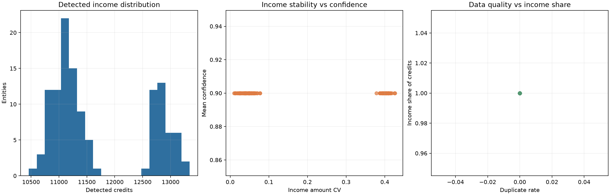

# Cashflow Intelligence Report

All transactions are synthetic. This report evaluates normalization, income detection, confidence, recurring cashflow features, duplicate exposure, and balance integrity.

## Methodology

1. Generate synthetic salary, benefit, transfer, refund, purchase, and lender-like transactions.
2. Normalize dates, amounts, descriptions, and duplicate keys.
3. Detect income only when the transaction is a positive credit and matches a category pattern.
4. Exclude lender-like flows from income classification.
5. Aggregate entity-level temporal features.

## Summary statistics

| Feature | Mean | Std |
| --- | ---: | ---: |
| income_events | 7.0000 | 1.4201 |
| total_detected_income | 11694.3543 | 863.0771 |
| income_amount_cv | 0.1623 | 0.1711 |
| income_share_of_credits | 1.0000 | 0.0000 |
| duplicate_rate | 0.0000 | 0.0000 |
| credit_debit_ratio | 4.3866 | 1.5730 |

## Balance reconciliation

`{'rows': 2531, 'pass_rate': 1.0, 'mean_absolute_error': 5.795372961542326e-14, 'max_absolute_error': 1.8189894035458565e-12}`

The check verifies that previous balance plus credits minus debits matches the reported balance.

## Limitations

The generator is synthetic and does not represent real financial institutions, people, employers, or production performance. A production extension would add audited labels, cadence validation, source-specific parsers, and human-reviewed error analysis.
