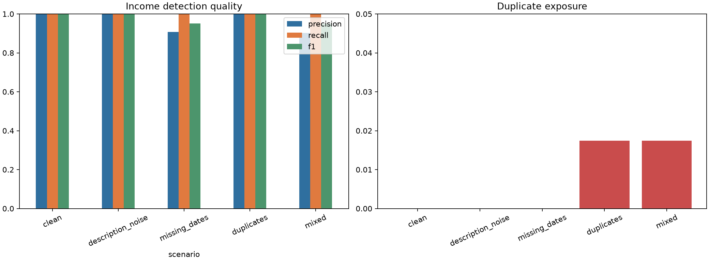

# Cashflow Scenario Report

All transactions are synthetic. This report measures income detection under controlled raw-data corruption.

| Scenario | Precision | Recall | F1 | Category accuracy | Duplicate rate |
| --- | ---: | ---: | ---: | ---: | ---: |
| clean | 1.000 | 1.000 | 1.000 | 1.000 | 0.000 |
| description_noise | 1.000 | 1.000 | 1.000 | 1.000 | 0.000 |
| missing_dates | 0.907 | 1.000 | 0.951 | 1.000 | 0.000 |
| duplicates | 1.000 | 1.000 | 1.000 | 1.000 | 0.017 |
| mixed | 0.902 | 1.000 | 0.949 | 1.000 | 0.017 |

The benchmark separates false income detections from missed income and measures whether detected income is assigned to the correct category.
